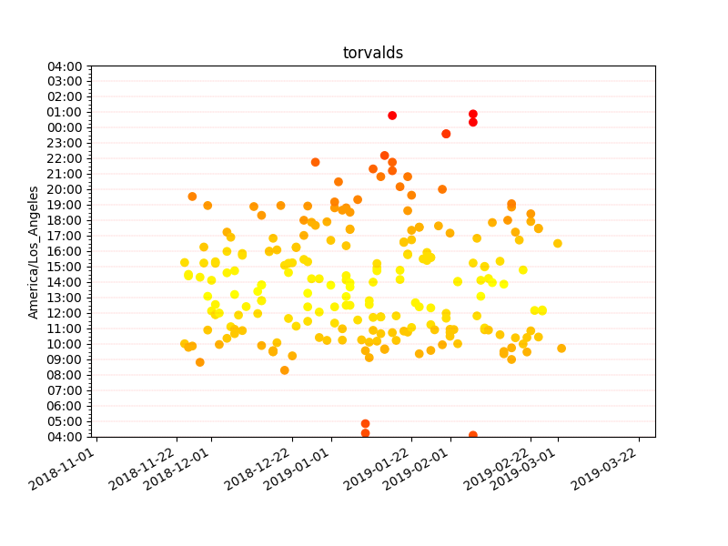

# Code time tracking

For a healthier, happier open source community.

## Get started
Modify `config.ini` and `config.py`. Run `pip install -r requirements.txt`. Start databases with
`python models.py`. 

## (Optional)
Test retrieval with `python codetimes.py <github-username>`.

Start the server with `python app.py`.

## Example

